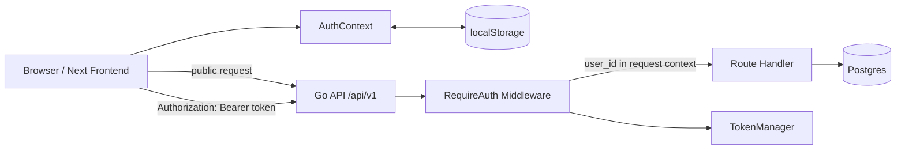
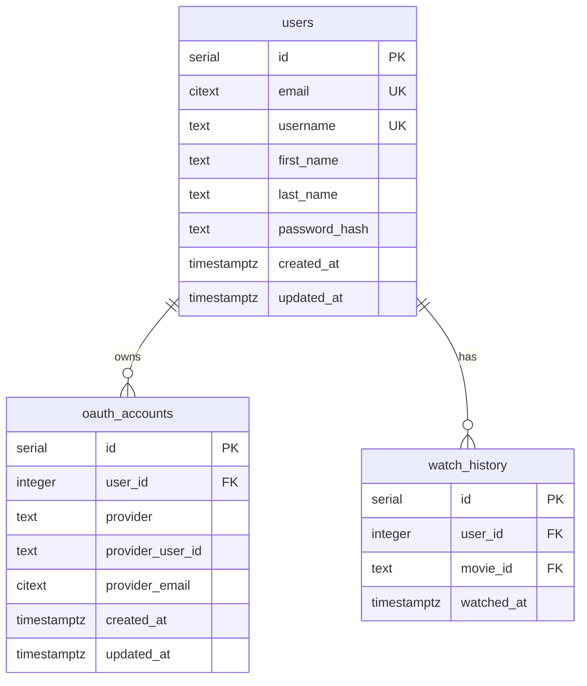
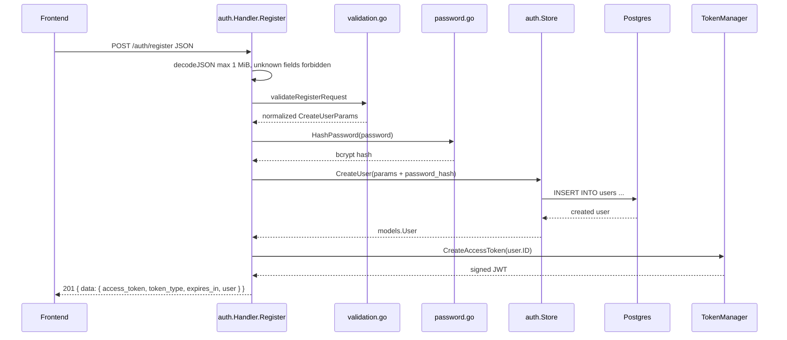
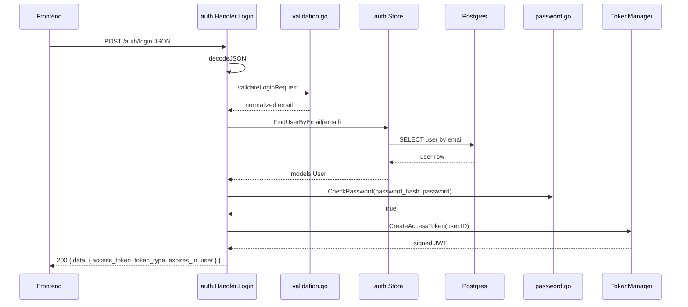
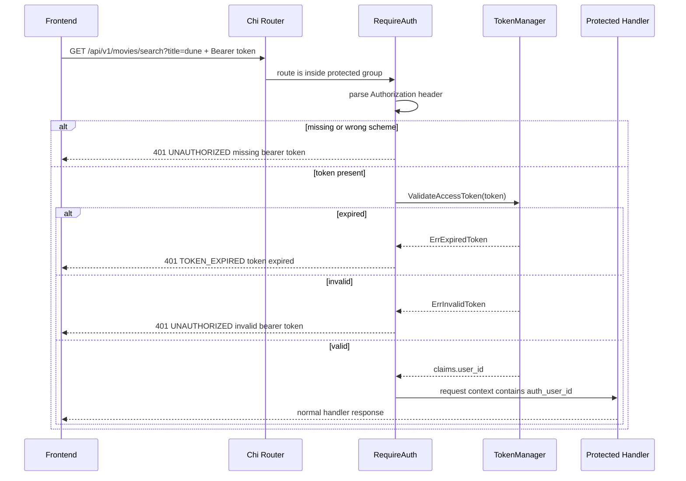
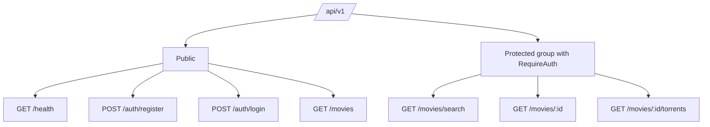
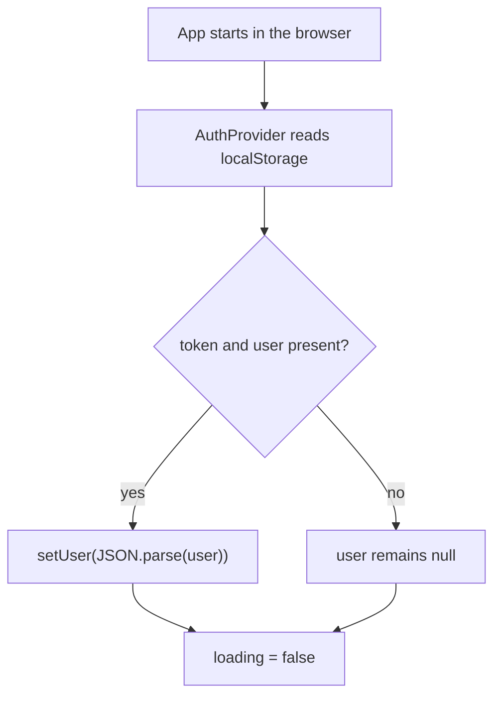

# Auth Documentation

This document explains the current authentication setup in this repository.
Important: the root README still mentions OAuth2, GitHub/42 login, and password
reset. In the current codebase, only the database preparation for OAuth exists.
The active implementation is email/password authentication with bcrypt and
JWT bearer tokens.

## Summary

- Backend: Go API with Chi router under `/api/v1`.
- Registration: `POST /api/v1/auth/register`.
- Login: `POST /api/v1/auth/login`.
- Token: JWT with `HS256`, `user_id` claim, `iss`, `sub`, `iat`, `nbf`, `exp`.
- Lifetime: 15 minutes (`expires_in: 900`).
- Transport: `Authorization: Bearer <access_token>`.
- Backend protection: `auth.RequireAuth(tokenManager)` in `services/api/main.go`.
- Frontend protection: currently local only, via `AuthContext` and `localStorage`.
- Frontend API integration: not finished yet. The service files are empty and
  login/register currently use mock data.

## Relevant Files

| Area | File | Purpose |
| --- | --- | --- |
| Router and protection boundary | `services/api/main.go` | Registers public routes and the protected route group. |
| Auth handler | `services/api/internal/auth/handler.go` | Register/login, JSON parsing, response envelope. |
| JWT | `services/api/internal/auth/jwt.go` | Creates and validates tokens. |
| Middleware | `services/api/internal/auth/middleware.go` | Checks bearer header, validates token, writes `user_id` into context. |
| Passwords | `services/api/internal/auth/password.go` | bcrypt hashing and password comparison. |
| Validation | `services/api/internal/auth/validation.go` | Email, username, name, and password rules. |
| User store | `services/api/internal/auth/store.go` | Creates users and loads users by email. |
| DB schema | `db/001_schema.sql`, `db/003_auth.sql` | `users`, `oauth_accounts`, `watch_history`. |
| Response helpers | `services/api/internal/respond/respond.go` | Common `data`/`error` JSON responses. |
| Frontend context | `frontend/src/context/AuthContext.tsx` | Stores user/token in `localStorage`, login/logout state. |
| Frontend modals | `frontend/src/components/modal/Signin.tsx`, `Register.tsx` | Current mock login/register. |
| Frontend route guard | `frontend/src/app/users/layout.tsx` | Protects `/users` and nested routes in the frontend. |

## Overall Architecture



The backend is the actual security boundary. The frontend can hide buttons,
pages, and inputs, but all sensitive reads and writes must be protected in the
backend with middleware.

## Backend Startup and Configuration

During startup in `services/api/main.go`:

1. Connects to Postgres via `DATABASE_URL`.
2. Initializes the `TokenManager` with `JWT_SECRET` and `JWT_ISSUER`.
3. Creates `auth.Store` and `auth.Handler`.
4. Registers public routes.
5. Registers a protected Chi group with `auth.RequireAuth`.

Auth-related environment variables:

| Variable | Meaning |
| --- | --- |
| `JWT_SECRET` | Must be at least 32 bytes. Otherwise the API will not start. |
| `JWT_ISSUER` | Optional. Defaults to `hypertube-api`. Checked during validation. |
| `DATABASE_URL` | Postgres connection string. |
| `PORT` | API port. Defaults to `8080`. |

Example secret:

```bash
openssl rand -base64 32
```

## Data Model

Authentication currently mainly uses the `users` table:



`oauth_accounts` exists in the schema, but there are currently no OAuth2 routes,
OAuth2 handlers, or provider implementations in the backend.

## Registration

Endpoint:

```http
POST /api/v1/auth/register
Content-Type: application/json
```

Request:

```json
{
  "email": "ada@example.com",
  "username": "ada_lovelace",
  "first_name": "Ada",
  "last_name": "Lovelace",
  "password": "correct-horse-battery"
}
```

Flow:



Validation rules:

| Field | Rule |
| --- | --- |
| `email` | Trimmed, lowercased, and validated with `net/mail`. |
| `username` | 3 to 32 characters, only letters, digits, and `_`. |
| `first_name` | Required, maximum 100 characters. |
| `last_name` | Required, maximum 100 characters. |
| `password` | 8 to 72 bytes. |

Passwords are hashed with bcrypt cost `12`. Plaintext passwords are not stored
in the database.

Success response:

```json
{
  "data": {
    "access_token": "<jwt>",
    "token_type": "Bearer",
    "expires_in": 900,
    "user": {
      "id": 1,
      "email": "ada@example.com",
      "username": "ada_lovelace",
      "first_name": "Ada",
      "last_name": "Lovelace"
    }
  }
}
```

Typical errors:

| Status | Code | When |
| --- | --- | --- |
| `400` | `BAD_REQUEST` | JSON is invalid, contains unknown fields, or contains multiple JSON objects. |
| `400` | `VALIDATION_ERROR` | Email, username, name, or password is invalid. |
| `409` | `USER_EXISTS` | Email or username already exists. |
| `500` | `INTERNAL_ERROR` | Database or token creation failure. |

## Login

Endpoint:

```http
POST /api/v1/auth/login
Content-Type: application/json
```

Request:

```json
{
  "email": "ada@example.com",
  "password": "correct-horse-battery"
}
```

Flow:



For an unknown email or wrong password, the backend intentionally returns the
same response:

```json
{
  "error": {
    "code": "INVALID_CREDENTIALS",
    "message": "invalid email or password"
  }
}
```

## JWT Details

Token creation in `services/api/internal/auth/jwt.go`:

- Algorithm: `HS256`.
- Secret: `JWT_SECRET`, at least 32 bytes.
- Issuer: `JWT_ISSUER`, default `hypertube-api`.
- TTL: 15 minutes.
- Claims:
  - `user_id`: numeric user ID.
  - `iss`: issuer.
  - `sub`: user ID as string.
  - `iat`: issued-at time.
  - `nbf`: not-before time.
  - `exp`: expiration time.

Validation:

1. The token is parsed with `jwt.ParseWithClaims`.
2. The signing method must be `HS256`.
3. The issuer must match.
4. `exp` is required and must not be expired.
5. `user_id` must be greater than `0`.

Important: the middleware currently does not perform a database lookup. If a
user were deleted or disabled, an already issued token would remain valid until
it expires, as long as its signature and claims are valid.

There are currently no refresh tokens, no server-side session, no token
blacklist, and no logout endpoint. Logout is frontend-only: the token and user
are removed from `localStorage`.

## Protected Requests

Every protected backend request needs this header:

```http
Authorization: Bearer <access_token>
```

Middleware flow:



Handlers can read the current user like this:

```go
userID, ok := auth.UserIDFromContext(r.Context())
if !ok {
    respond.Error(w, http.StatusUnauthorized, "UNAUTHORIZED", "missing user context")
    return
}
```

The movie handlers do not currently use this context yet. They only protect
access; they do not perform user-specific logic.

## Backend Routes

All routes are mounted under `/api/v1`.

| Route | Status | Protection | Handler |
| --- | --- | --- | --- |
| `GET /health` | Active | Public | Inline healthcheck |
| `POST /auth/register` | Active | Public | `authHandler.Register` |
| `POST /auth/login` | Active | Public | `authHandler.Login` |
| `GET /movies` | Active | Public | `moviesHandler.GetMovies` |
| `GET /movies/search?title=...` | Active | Protected | `moviesHandler.SearchMovies` |
| `GET /movies/{id}` | Active | Protected | `moviesHandler.GetMoviesId` |
| `GET /movies/{id}/torrents` | Active | Protected | `moviesHandler.GetMovieTorrents` |
| `GET /users` | Commented | Not registered | Not active yet |
| `GET /users/{id}` | Commented | Not registered | Not active yet |
| `PATCH /users/{id}` | Commented | Not registered | Not active yet |
| `GET /movies/{id}/comments` | Commented | Not registered | Not active yet |
| `POST /movies/{id}/comments` | Commented | Not registered | Not active yet |
| `GET /comments` | Commented | Not registered | Not active yet |
| `GET /comments/{id}` | Commented | Not registered | Not active yet |
| `POST /comments` | Commented | Not registered | Not active yet |
| `PATCH /comments/{id}` | Commented | Not registered | Not active yet |
| `DELETE /comments/{id}` | Commented | Not registered | Not active yet |

Route tree:



## Where to Change Backend Route Protection

The source of truth is `services/api/main.go`.

Public routes are registered directly under `r.Route("/api/v1", ...)`, for
example:

```go
r.Get("/movies", moviesHandler.GetMovies)
```

Protected routes are registered inside this group:

```go
r.Group(func(r chi.Router) {
    r.Use(auth.RequireAuth(tokenManager))

    r.Get("/movies/search", moviesHandler.SearchMovies)
    r.Get("/movies/{id}", moviesHandler.GetMoviesId)
    r.Get("/movies/{id}/torrents", moviesHandler.GetMovieTorrents)
})
```

To protect a route:

1. Remove the route from the public area.
2. Move the same route into the `r.Group` that uses `RequireAuth`.
3. If the handler needs user-specific data, read it with
   `auth.UserIDFromContext(r.Context())`.
4. Add or update tests for missing, invalid, and valid tokens.

To make a route public:

1. Remove the route from the protected group.
2. Register it directly in the `/api/v1` block.
3. Ensure the handler does not require a user ID.
4. Adjust tests so requests without a token are allowed.

## Current Frontend State

`AuthProvider` in `frontend/src/context/AuthContext.tsx` is mounted globally in
`frontend/src/app/layout.tsx`. It manages:

- `user: tUser | null`
- `loading: boolean`
- `login(user, token)`
- `logout()`
- `updateUser(patch)`

Persistence:



Current frontend login:

- `Signin.tsx` searches for a mock user in `frontend/src/types/user.ts`.
- If found, it calls `login(findUser[0], "coucou")`.
- The entered password is not checked against the backend.
- The stored token is not a real JWT.

Current frontend registration:

- `Register.tsx` locally builds a `tUser` object.
- It then calls `login(user, "coucou")`.
- There is currently no backend request.

Service files:

- `frontend/src/services/api.ts` is empty.
- `frontend/src/services/auth.ts` is empty.
- `frontend/src/services/movies.ts` is empty.

This means backend auth works, but the frontend is not connected to backend auth
yet.

## Frontend Routes

| Frontend route | Protection | How |
| --- | --- | --- |
| `/` | Public | Uses `user` only for personalized sections. |
| `/movies` | Public | No frontend auth requirement. |
| `/movies/[id]` | Public | Comment input only when `user !== null`. |
| `/users` | Protected | `frontend/src/app/users/layout.tsx` redirects to `/` without a user. |
| `/users/[id]` | Protected | Covered by the same `/users` layout. |

Important: frontend route protection is only UX. Real protection only exists
when the backend route is protected and the backend validates the bearer token.

## Where to Change Frontend Route Protection

For a whole route group:

1. Create a client-side layout in `frontend/src/app/<route>/layout.tsx`.
2. Read `useAuth()`.
3. Render nothing while `loading` is true.
4. Without a user, redirect or open the login modal.

Pattern from `frontend/src/app/users/layout.tsx`:

```tsx
"use client";

import {useAuth} from "@/context/AuthContext";
import {useRouter} from "next/navigation";
import React, {useEffect} from "react";

export default function ProtectedLayout({children}: {children: React.ReactNode}) {
    const {user, loading} = useAuth();
    const router = useRouter();

    useEffect(() => {
        if (!loading && !user)
            router.push("/");
    }, [user, loading, router]);

    if (loading) return null;
    if (!user) return null;

    return children;
}
```

For individual UI actions:

```tsx
const {user} = useAuth();

if (!user) {
    openModal({type: "signin"});
    return;
}

// Run the action
```

## How the Frontend Should Use the Auth API

The following snippets are integration suggestions. They replace the current
mock calls in `Signin.tsx` and `Register.tsx`.

### API Base

`frontend/src/services/api.ts`:

```tsx
const API_BASE_URL = process.env.NEXT_PUBLIC_API_URL ?? "http://localhost:8080/api/v1";

type ApiEnvelope<T> = {
    data: T;
};

type ApiErrorEnvelope = {
    error: {
        code: string;
        message: string;
    };
};

export async function apiFetch<T>(
    path: string,
    options: RequestInit & {auth?: boolean} = {},
): Promise<T> {
    const headers = new Headers(options.headers);

    if (options.body && !headers.has("Content-Type"))
        headers.set("Content-Type", "application/json");

    if (options.auth) {
        const token = localStorage.getItem("token");
        if (token)
            headers.set("Authorization", `Bearer ${token}`);
    }

    const res = await fetch(`${API_BASE_URL}${path}`, {
        ...options,
        headers,
    });

    const json = (await res.json()) as ApiEnvelope<T> | ApiErrorEnvelope;

    if (!res.ok) {
        const message = "error" in json ? json.error.message : "request failed";
        throw new Error(message);
    }

    return (json as ApiEnvelope<T>).data;
}
```

### Auth Service

Backend users and frontend users currently use different field names:

- Backend: `first_name`, `last_name`
- Frontend: `firstname`, `lastname`

Therefore the frontend needs either an adapter or the frontend type should be
aligned with the backend.

`frontend/src/services/auth.ts`:

```tsx
import {apiFetch} from "@/services/api";
import {tUser} from "@/types/user";

type BackendUser = {
    id: number;
    email: string;
    username: string;
    first_name: string;
    last_name: string;
};

type AuthResponse = {
    access_token: string;
    token_type: "Bearer";
    expires_in: number;
    user: BackendUser;
};

type RegisterPayload = {
    email: string;
    username: string;
    first_name: string;
    last_name: string;
    password: string;
};

function toFrontendUser(user: BackendUser): tUser {
    return {
        id: user.id,
        username: user.username,
        firstname: user.first_name,
        lastname: user.last_name,
        email: user.email,
        color: "purple",
        profile_picture: null,
        watch_history: [],
        joined_at: Date.now(),
    };
}

export async function loginWithPassword(email: string, password: string) {
    const data = await apiFetch<AuthResponse>("/auth/login", {
        method: "POST",
        body: JSON.stringify({email, password}),
    });

    return {
        user: toFrontendUser(data.user),
        token: data.access_token,
        expiresIn: data.expires_in,
    };
}

export async function registerWithPassword(payload: RegisterPayload) {
    const data = await apiFetch<AuthResponse>("/auth/register", {
        method: "POST",
        body: JSON.stringify(payload),
    });

    return {
        user: toFrontendUser(data.user),
        token: data.access_token,
        expiresIn: data.expires_in,
    };
}
```

### Connect the Signin Modal

`Signin.tsx` should use an email/login call instead of the username mock,
because the backend expects login by `email`:

```tsx
const {user, token} = await loginWithPassword(email, password);
login(user, token);
closeModal();
```

For this, the `username` field in `Signin.tsx` should be renamed to `email`, or
the modal should get a separate email field.

### Connect the Register Modal

The backend expects `first_name` and `last_name`, not `firstname` and
`lastname`:

```tsx
const {user, token} = await registerWithPassword({
    email,
    username,
    first_name: firstname,
    last_name: lastname,
    password,
});

login(user, token);
closeModal();
```

### Calling Protected Backend Routes from the Frontend

Example protected movie search:

```tsx
const movies = await apiFetch<MovieResponse[]>("/movies/search?title=dune", {
    method: "GET",
    auth: true,
});
```

Without `auth: true`, no `Authorization` header is set and the API responds with
`401`.

For `401 TOKEN_EXPIRED`, the frontend should log the user out or force a new
login:

```tsx
try {
    await apiFetch("/movies/search?title=dune", {auth: true});
} catch (error) {
    logout();
    openModal({type: "signin"});
}
```

In a real implementation, `apiFetch` should preserve the API error code, not
only the message. Then the frontend can distinguish `TOKEN_EXPIRED`,
`UNAUTHORIZED`, and other errors cleanly.

## Curl Examples

Register:

```bash
curl -sS -X POST http://localhost:8080/api/v1/auth/register \
  -H 'Content-Type: application/json' \
  -d '{
    "email": "ada@example.com",
    "username": "ada_lovelace",
    "first_name": "Ada",
    "last_name": "Lovelace",
    "password": "correct-horse-battery"
  }'
```

Login:

```bash
curl -sS -X POST http://localhost:8080/api/v1/auth/login \
  -H 'Content-Type: application/json' \
  -d '{
    "email": "ada@example.com",
    "password": "correct-horse-battery"
  }'
```

Protected route:

```bash
TOKEN="<access_token>"

curl -sS 'http://localhost:8080/api/v1/movies/search?title=dune' \
  -H "Authorization: Bearer $TOKEN"
```

## Security Notes and Current Gaps

- `localStorage` is convenient, but more risky than HttpOnly cookies if an XSS
  issue exists. If the app is hardened later, token storage should be reviewed.
- There are no refresh tokens. After 15 minutes, the user must log in again.
- Logout does not invalidate the token on the server.
- The middleware does not check whether the user still exists in the database.
- OAuth2, password reset, and user management routes are not active yet.
- If the frontend and API run on different origins, the API still needs CORS
  configuration or the frontend must use a proxy.
- The root README is partly stale: it describes OAuth2 as active, while the code
  currently uses JWT after email/password login.

## Tests

Auth is covered by backend unit tests:

- `services/api/internal/auth/password_test.go`
- `services/api/internal/auth/jwt_test.go`
- `services/api/internal/auth/handler_test.go`
- `services/api/internal/auth/middleware_test.go`

When changing protected routes, at least these cases should be tested:

1. Request without `Authorization` header returns `401`.
2. Request with the wrong scheme, for example `Basic ...`, returns `401`.
3. Request with an invalid bearer token returns `401`.
4. Request with an expired token returns `401 TOKEN_EXPIRED`.
5. Request with a valid token reaches the handler.
