# Protecting Streaming Endpoints with Authentication

This document explains the authentication problem around the streaming
endpoints, why it exists, why streaming makes it more subtle than normal API
requests, and which implementation strategies are available.

The goal is that someone who does not know this codebase, Docker, JWT, or HLS
can still understand the issue and make a reasonable technical decision.

## Short Answer

The API container already protects many routes with JWT authentication.

The streaming endpoints are different. They live in a separate service:

- API service: `api`, exposed on port `8080`
- Streaming service: `torrent-stream`, exposed on port `8081`

Because `torrent-stream` is exposed directly, a user may be able to call the
streaming URLs without going through the authenticated API.

In simple terms:

> We locked the front door of the API, but the video service currently has its
> own public side door.

The important streaming routes are:

| Route | Purpose | Must Be Protected |
| --- | --- | --- |
| `GET /stream/{id}` | Starts or prepares a stream | Yes |
| `GET /stream/{id}/index` | Returns the HLS playlist | Yes |
| `GET /stream/{id}/{segment}` | Returns video segment files | Yes |

Protecting only `GET /stream/{id}` is not enough. HLS video playback also
fetches the playlist and many segment files after the stream starts.

## Current Situation

The application is split into multiple containers.

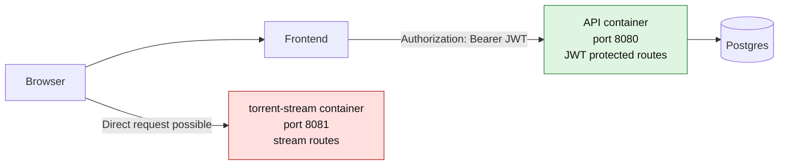

The API has an authentication middleware. Protected API routes require:

```text
Authorization: Bearer <access_token>
```

The stream service is a separate HTTP server. Its routes are mounted directly
under `/stream/...`. If port `8081` is reachable from the browser or from the
outside network, the stream service can be called without passing through the
API middleware.

## Relevant Files In This Repository

| File | Why It Matters |
| --- | --- |
| `docker-compose.yml` | Exposes `api` on `8080` and `torrent-stream` on `8081`. This is where public port exposure is controlled. |
| `services/api/main.go` | Registers public and protected API routes. Protected routes use `auth.RequireAuth(...)`. |
| `services/api/internal/auth/middleware.go` | Validates `Authorization: Bearer <access_token>` for protected API requests. |
| `services/api/internal/auth/jwt.go` | Creates and validates JWT access tokens. |
| `services/torrent-stream/main.go` | Registers `/stream/{id}`, `/stream/{id}/index`, and `/stream/{id}/{segment}` separately from the API. |
| `services/torrent-stream/internal/stream/handler.go` | Serves the HLS playlist and segment files. These handlers currently need an auth strategy around them. |

## Why This Is a Real Security Problem

Authentication must protect the resource itself, not only the page or button
that links to it.

If the frontend hides a "Play" button from logged-out users, that is only a UI
restriction. A user can still open the browser devtools, inspect network
requests, or manually type a URL.

If the API requires login but the stream service does not, then the user can
skip the API and call the stream service directly.

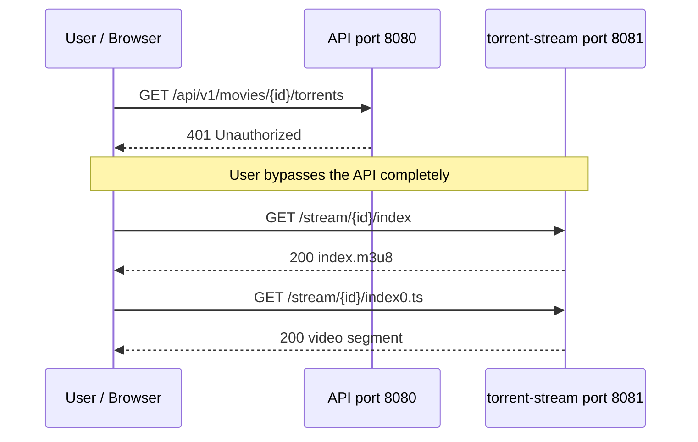

This would mean the application has authentication, but the actual video
content is still reachable without authentication.

## Why HLS Makes This More Subtle

HLS usually works like this:

1. The player requests a playlist file, usually `.m3u8`.
2. The playlist contains many segment file names, usually `.ts` or `.m4s`.
3. The player automatically requests those segment files.
4. Playback continues while more segments are downloaded.

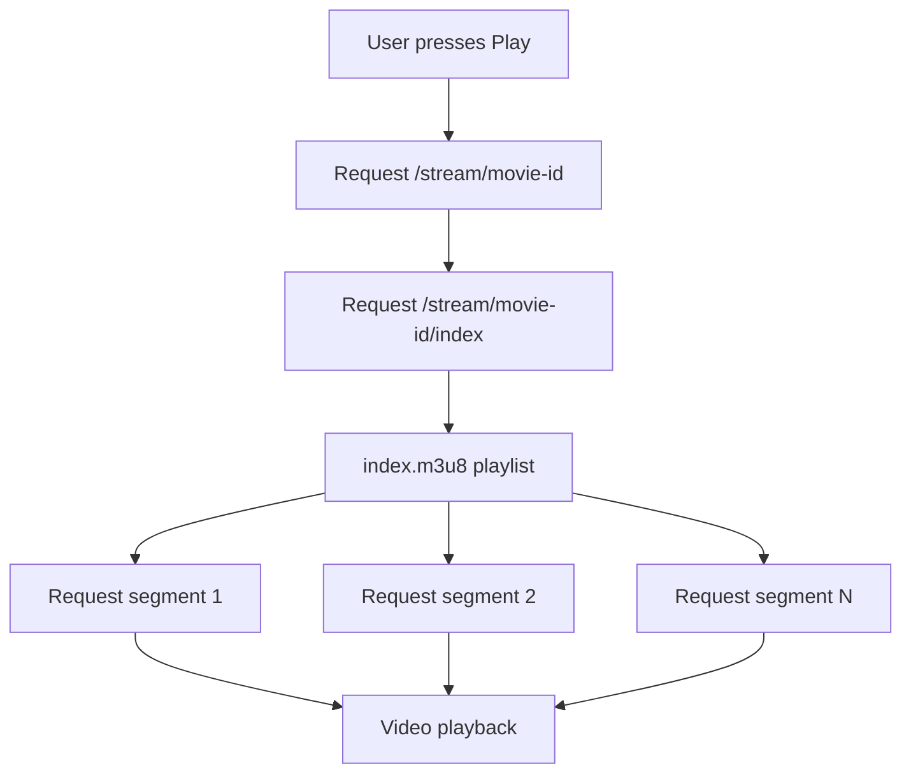

This matters because authentication must cover every request in that chain.

For a normal JSON API call, the frontend can easily send an `Authorization`
header. For video playback, the browser's native `<video>` element may fetch
playlist and segment files by itself. Depending on the player, it may not be
easy or possible to attach a custom `Authorization` header to every automatic
segment request.

That is the core reason this problem needs a deliberate strategy.

There is one more important difference: video playback is long-running. A
normal API request usually finishes in milliseconds or seconds. A movie may
play for two hours. If the access token expires after 15 minutes, then a design
that checks the JWT on every segment request must decide what should happen
during playback:

- should playback stop when the user token expires?
- should the frontend refresh the token while the player is running?
- should the API issue a separate stream ticket that lasts long enough for the
  playback session?
- should segment URLs be short-lived but renewable?

This is not only a security decision. It directly affects user experience and
debugging.

## What Must Be Protected

A secure solution must satisfy all of these rules:

| Requirement | Explanation |
| --- | --- |
| No direct public access to `torrent-stream` | Users should not be able to reach port `8081` directly in production. |
| Stream start is authenticated | Starting a torrent or transcoding job must require a valid user. |
| Playlist is authenticated | The `.m3u8` file reveals all segment URLs and controls playback. |
| Segments are authenticated or unguessable and short-lived | Segment files are the actual video content. |
| Auth decision cannot rely on frontend state only | `localStorage`, React state, and hidden buttons are not security boundaries. |
| Expired or invalid tokens fail cleanly | A logged-out or expired user should get `401`, not partial playback or confusing errors. |
| Debugging is observable | Logs should make it clear whether a failure is auth, routing, HLS, CORS, or file generation. |

## Strategy 1: API as an Authenticated Stream Proxy

The browser talks only to the API. The API verifies the JWT and then proxies the
request to the internal stream service.

The stream service is not publicly exposed. It is reachable only from inside
the Docker network.

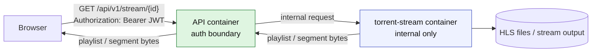

### How It Works

The API receives requests such as:

- `/api/v1/stream/{id}`
- `/api/v1/stream/{id}/index`
- `/api/v1/stream/{id}/{segment}`

Each request goes through the existing API authentication middleware.

After the JWT is validated, the API forwards the request to `torrent-stream`
inside Docker. The browser never talks to `torrent-stream` directly.

### Why This Is Easy To Understand

There is one public backend: the API.

If a request needs authentication, it goes through the API. If the API rejects
the user, the stream is not reachable.

### Pros

| Advantage | Why It Matters |
| --- | --- |
| One authentication boundary | The existing API auth model remains the source of truth. |
| Hard to bypass | `torrent-stream` can be internal-only. |
| Good for a first secure implementation | The mental model is simple. |
| Works with native video more easily | The browser can load API URLs directly. |

### Cons

| Disadvantage | Impact |
| --- | --- |
| API handles video traffic | The API must efficiently proxy larger streaming responses. |
| More load on API container | Video bytes pass through the API instead of going directly from the stream service. |
| Proxy details matter | Headers, content types, range requests, cancellation, and timeouts must be handled carefully. |

### Effort And Debug Complexity

| Category | Estimate |
| --- | --- |
| Implementation effort | Medium |
| Typical time | 1-2 days for a simple version, 2-4 days if range requests, cancellation, and robust logging are included |
| Debug complexity | Medium |
| Main debug risks | Proxy timeouts, wrong content type, dropped response body, HLS player errors that look like auth errors |
| Best fit | Current project stage, when clarity and correctness matter more than maximum streaming efficiency |

### Debug Checklist

- Confirm `torrent-stream` is no longer exposed publicly.
- Confirm unauthenticated `/api/v1/stream/...` requests return `401`.
- Confirm authenticated playlist requests return `application/vnd.apple.mpegurl`.
- Confirm authenticated segment requests return the correct video content type.
- Confirm playback stops when the JWT is missing or invalid.
- Confirm API logs show user ID, movie ID, route type, and upstream status.

## Strategy 2: Add JWT Authentication Directly To `torrent-stream`

The stream service validates the same JWT as the API.

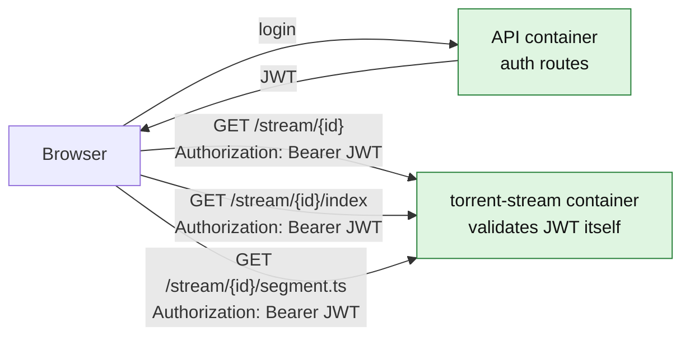

### How It Works

Both services receive the same `JWT_SECRET` and `JWT_ISSUER`.

The stream service adds middleware similar to the API's auth middleware. Every
stream route validates:

```text
Authorization: Bearer <access_token>
```

### The Important HLS Problem

This strategy only works if the video player can send the `Authorization`
header on every request:

- stream init request
- playlist request
- every segment request

With a custom HLS player such as `hls.js`, this is often possible by configuring
request hooks.

With native `<video src="...">`, this is often not enough because the browser
controls the segment requests and does not let the application attach custom
headers in the same simple way.

### Pros

| Advantage | Why It Matters |
| --- | --- |
| Direct streaming path | Video traffic does not pass through the API. |
| Good performance model | The stream service serves its own data. |
| Clear ownership | The service that owns the resource protects the resource. |

### Cons

| Disadvantage | Impact |
| --- | --- |
| Auth logic must exist in two services | Shared code or duplicated validation logic is needed. |
| JWT secret is shared with another container | More places can validate or potentially misuse tokens. |
| Frontend player must support auth headers | Native video playback may not work cleanly. |
| More CORS complexity | Cross-origin requests to `:8081` with headers require correct CORS handling. |

### Effort And Debug Complexity

| Category | Estimate |
| --- | --- |
| Implementation effort | Medium |
| Typical time | 1-3 days depending on frontend player support |
| Debug complexity | Medium to High |
| Main debug risks | Missing headers on segment requests, CORS preflight failures, expired tokens mid-playback, duplicated auth behavior |
| Best fit | When direct stream performance matters and the frontend will use a player that can attach auth headers to HLS requests |

### Debug Checklist

- Confirm every `/stream/...` route rejects missing tokens.
- Confirm every `/stream/...` route rejects invalid and expired tokens.
- Confirm the frontend player sends the header on playlist and segment requests.
- Confirm CORS allows the `Authorization` header if ports or domains differ.
- Confirm token expiration during playback has a defined behavior.

## Strategy 3: Short-Lived Signed Stream URLs

The API verifies the user once and gives the frontend a temporary stream URL.
The stream service does not need to know the full user session. It only verifies
that the URL signature is valid and not expired.

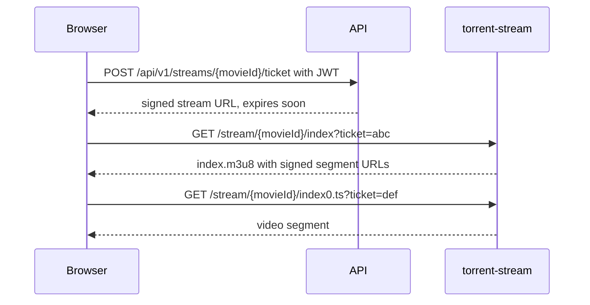

### How It Works

The API remains the place where user authentication happens.

After the API accepts the user's JWT, it creates a signed streaming ticket. The
ticket can include:

- movie ID
- user ID
- expiry time
- allowed route type
- optional session ID or playback ID

The stream service receives URLs with a signature or ticket and validates them.
If the signature is valid and the ticket has not expired, the stream service
serves the playlist or segment.

For HLS, the playlist should either:

- include signed segment URLs, or
- include segment URLs that reuse a valid playback ticket.

### Pros

| Advantage | Why It Matters |
| --- | --- |
| Efficient streaming | Browser can fetch video directly from the stream service. |
| Stream service does not need full JWT auth | It only validates purpose-built stream tickets. |
| Works better with native video | Query parameters can be used by automatic playlist and segment requests. |
| Easy to expire access | Tickets can be short-lived. |

### Cons

| Disadvantage | Impact |
| --- | --- |
| More design work | Ticket format, signing, expiry, and playlist rewriting must be designed. |
| Query tokens can leak | URLs may appear in logs, browser history, referrers, or screenshots. |
| Playlist generation becomes security-sensitive | Segment URLs must not accidentally be left unsigned. |
| Revocation is harder | Stateless tickets are valid until expiry unless server-side state is added. |

### Effort And Debug Complexity

| Category | Estimate |
| --- | --- |
| Implementation effort | High |
| Typical time | 3-6 days for a robust version |
| Debug complexity | High |
| Main debug risks | Expired tickets, clock drift, unsigned segment URLs, URL encoding bugs, confusing player retries |
| Best fit | Production-oriented streaming where direct video delivery matters and the team can invest in a cleaner token design |

### Debug Checklist

- Confirm signed URLs expire when expected.
- Confirm tickets cannot be reused for a different movie ID.
- Confirm segment URLs are signed or otherwise bound to the same playback grant.
- Confirm expired tickets fail with `401` or `403`, not `500`.
- Confirm logs do not expose full reusable tickets in unsafe places.
- Confirm clock skew between containers does not break valid tickets.

## Strategy 4: Reverse Proxy With Central Auth Check

A reverse proxy such as Nginx, Caddy, or Traefik becomes the only public entry
point. It routes API requests to the API and stream requests to the stream
service. Before forwarding stream requests, it asks the API whether the request
is allowed.

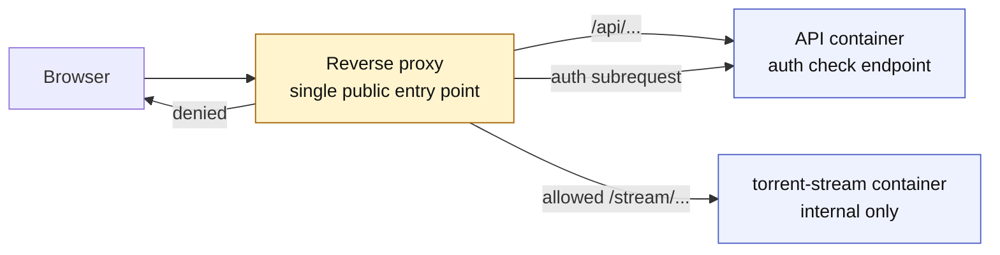

### How It Works

The browser never talks directly to `api:8080` or `torrent-stream:8081`.

Instead, it talks to one public host, for example:

- `/api/v1/...`
- `/stream/...`

For stream requests, the reverse proxy performs an auth check. The API validates
the token or cookie and returns allowed or denied. The proxy only forwards the
request to `torrent-stream` if the auth check succeeds.

### Pros

| Advantage | Why It Matters |
| --- | --- |
| Clean public boundary | Only the proxy is exposed. |
| Stream service remains internal | Direct bypass is blocked at network level. |
| Good production architecture | This pattern scales well once configured correctly. |
| Can avoid API carrying video bytes | The proxy can forward stream bytes directly. |

### Cons

| Disadvantage | Impact |
| --- | --- |
| Adds infrastructure complexity | Proxy config becomes part of the security model. |
| Auth behavior is split | API validates identity, proxy enforces routing. |
| HLS still matters | Playlist and segment requests must also trigger auth checks. |
| Debugging crosses layers | Failures may be in browser, proxy, API, stream service, or CORS. |

### Effort And Debug Complexity

| Category | Estimate |
| --- | --- |
| Implementation effort | Medium to High |
| Typical time | 2-5 days depending on proxy choice and local/prod parity |
| Debug complexity | High |
| Main debug risks | Incorrect proxy rules, auth subrequest headers, caching mistakes, confusing `401` vs `403` vs `502` failures |
| Best fit | Deployment-focused setup where a reverse proxy is already planned or required |

### Debug Checklist

- Confirm only the proxy is publicly exposed.
- Confirm direct access to API and stream container ports is blocked.
- Confirm every `/stream/...` request triggers the auth rule.
- Confirm proxy forwards required headers.
- Confirm proxy does not cache protected content incorrectly.
- Confirm logs can correlate proxy request ID, API auth decision, and stream upstream status.

## Strategy 5: Cookie-Based Auth For Streaming

Instead of sending `Authorization` headers, the browser sends an HTTP-only
session cookie automatically to the same domain. The stream routes check that
cookie either directly or through a proxy/API auth check.

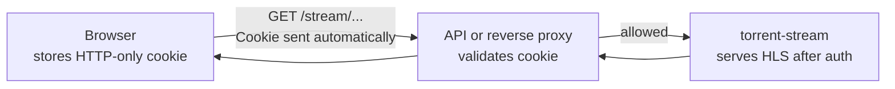

### How It Works

The user logs in and receives a secure HTTP-only cookie. Because the browser
sends cookies automatically, native video playback can work better than with
custom `Authorization` headers.

The cookie can be checked by:

- the API proxy,
- a reverse proxy auth check, or
- the stream service itself.

### Pros

| Advantage | Why It Matters |
| --- | --- |
| Works naturally with browser requests | The browser sends cookies on playlist and segment requests. |
| Better for native video than custom headers | Less player-specific configuration is needed. |
| Token not exposed to JavaScript | HTTP-only cookies reduce token theft from XSS. |

### Cons

| Disadvantage | Impact |
| --- | --- |
| Requires session/cookie design | Current auth is bearer-token based. |
| CSRF must be considered | Cookies are sent automatically, so unsafe routes need CSRF protection. |
| SameSite/domain rules matter | Local dev and production domains must be planned carefully. |
| Bigger auth architecture change | This affects more than streaming. |

### Effort And Debug Complexity

| Category | Estimate |
| --- | --- |
| Implementation effort | High |
| Typical time | 4-8 days if replacing or extending the current JWT frontend model |
| Debug complexity | Medium to High |
| Main debug risks | Cookie domain mismatch, SameSite issues, secure flag in local dev, CSRF gaps, mixed token and cookie behavior |
| Best fit | A broader auth redesign where the app wants browser-native session behavior |

## Baseline Hardening: Make `torrent-stream` Internal Only

This is not a complete solution by itself, but it should be part of most
solutions.

The stream service should not be directly reachable by users in production.

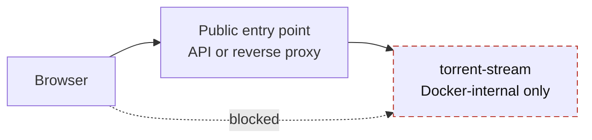

### What This Means

In Docker terms, this usually means:

- do not publish `8081` to the host in production,
- keep `torrent-stream` reachable only on the Docker network,
- expose streaming through the API or reverse proxy,
- if VPN mode is used, make sure the VPN container does not accidentally expose
  unauthenticated stream routes publicly.

### Effort And Debug Complexity

| Category | Estimate |
| --- | --- |
| Implementation effort | Low |
| Typical time | Less than 1 day |
| Debug complexity | Low to Medium |
| Main debug risks | Frontend still points to old `:8081` URL, health checks fail, VPN network mode changes port exposure |
| Best fit | Mandatory hardening step, but not enough without an authenticated public path |

## Decision Matrix

| Strategy | Security Strength | Performance | Implementation Effort | Debug Complexity | Native Video Friendly | Recommended Use |
| --- | --- | --- | --- | --- | --- | --- |
| API stream proxy | High | Medium | Medium | Medium | Good | Best first secure implementation |
| JWT inside stream service | Medium to High | High | Medium | Medium to High | Depends on player | Good if using `hls.js` or similar |
| Signed stream URLs | High if done carefully | High | High | High | Good | Best mature streaming design |
| Reverse proxy auth check | High | High | Medium to High | High | Good if auth uses cookies or signed URLs | Best production edge architecture |
| Cookie-based streaming auth | High if designed well | High | High | Medium to High | Very good | Best if redesigning auth around browser sessions |
| Internal-only stream service | Required baseline | N/A | Low | Low to Medium | N/A | Always do this in production |

## Recommended Path For This Project

The most pragmatic path is:

1. Make `torrent-stream` internal-only in production.
2. Add authenticated API routes that proxy stream init, playlist, and segment
   requests to `torrent-stream`.
3. Keep the browser talking to the API for streaming.
4. Add focused tests that unauthenticated users cannot access stream init,
   playlist, or segments.
5. Later, if performance becomes a real bottleneck, move to signed stream URLs
   or a reverse proxy auth-check setup.

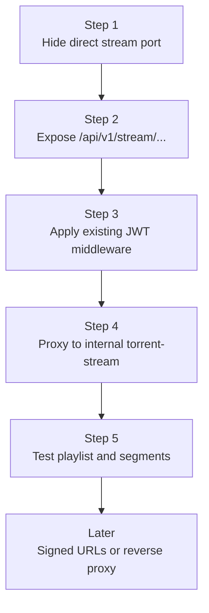

This keeps the first implementation understandable and reduces the chance of an
auth bypass. It also avoids solving a bigger token-signing or reverse-proxy
problem before the team has a working secure stream path.

## Common Mistakes To Avoid

| Mistake | Why It Is Dangerous |
| --- | --- |
| Protecting only `/stream/{id}` | The playlist and segment files may still expose the video. |
| Relying on frontend route guards | Frontend state can be bypassed with direct HTTP requests. |
| Leaving port `8081` public | Users can skip the API entirely. |
| Assuming HLS sends auth headers automatically | Native video requests may not include custom headers. |
| Returning unsigned segment URLs in a signed playlist | The playlist becomes protected, but the video chunks remain public. |
| Logging full signed URLs or tokens | Logs can become a source of leaked access. |
| Ignoring token expiry during playback | Long videos can fail halfway through in confusing ways. |

## Suggested Definition Of Done

A solution should not be considered complete until all of these are true:

- A logged-out user cannot start a stream.
- A logged-out user cannot fetch the HLS playlist.
- A logged-out user cannot fetch any segment file.
- A user cannot fetch a stream for a movie they are not allowed to watch.
- Direct access to `torrent-stream` from outside the backend network is blocked.
- The frontend uses only the approved public streaming path.
- Expired or invalid credentials return clear `401` or `403` responses.
- Logs can distinguish auth failure, upstream stream failure, missing file,
  transcoding failure, and player/CORS failure.

## Debugging Guide

When streaming does not work, identify which layer failed.

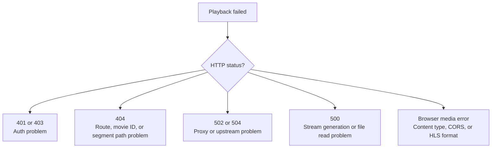

| Symptom | Likely Cause | Where To Look |
| --- | --- | --- |
| `401 Unauthorized` before playback starts | Missing or expired user auth | API auth logs, frontend token/session state |
| Playlist loads but segments fail | Segment URLs are not authenticated correctly or path rewriting is wrong | Playlist body, network tab, stream logs |
| Works in curl but not browser | CORS, cookies, or player request behavior | Browser devtools, request headers |
| Works locally but not in Docker | Service name, port exposure, or Docker network issue | Compose config, container logs |
| Video starts then stops later | Token or signed URL expiry during playback | Token TTL, ticket TTL, player retry logs |
| `500 failed to read index file` | HLS output was not generated or path is wrong | Stream service logs, filesystem volume |
| `502` or `504` from proxy | Proxy cannot reach upstream or upstream timed out | Proxy logs, stream health endpoint |

## Glossary

| Term | Meaning |
| --- | --- |
| API container | The Go backend service that owns login, JWT validation, movies, comments, and protected API routes. |
| Stream service | The separate Go service that prepares and serves video streams. |
| JWT | A signed access token used to prove that a request belongs to an authenticated user. |
| Bearer token | A token sent in the `Authorization` header. Whoever has it can use it until it expires. |
| HLS | HTTP Live Streaming. A video streaming format based on playlists and many small media segment files. |
| Playlist | The `.m3u8` file that tells the player which media segments to download. |
| Segment | A small piece of the video file, usually requested automatically by the player. |
| Reverse proxy | A public server that receives browser requests and forwards them to internal services. |
| Signed URL | A URL containing a cryptographic signature that proves it was created by the backend and has not expired. |
